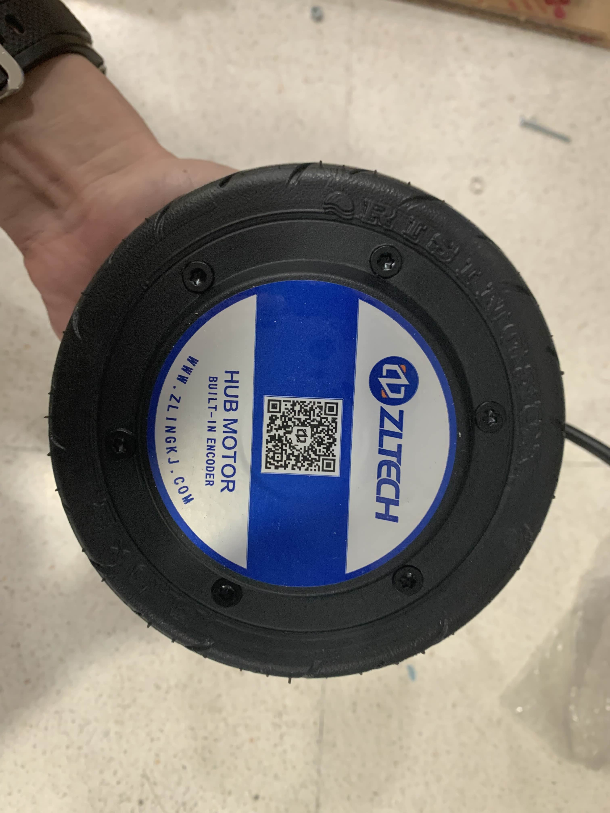

# A Python package of ZLAC8015D AC Servo Driver

This is a simple python package by using pymodbus to be able to access registers of ZLAC8015D. It uses RS485 communication.

You can find more detail of ZLAC8015D on their official site [here](http://www.zlrobotmotor.com/info/401.html).

You can find the main repository that this page is forked from [her](https://github.com/rasheeddo/ZLAC8015D_python)

## Hardware

ZLAC8015D is used to drive the ZLLG55ASM150 V2.0




The wiring diagram used for this project is a modification of the one from the original repository. The power cable used is of AWG12 standard to protect the machine from current surge. The grounding between the adapter and the battery is omitted.


The machine running this script should be Ubuntu or Mac


## Installation
```sh
#1. Install dependecies
sudo pip install requirements.txt

# 2. Get Serial Permission to communicate
sudo usermod -a -G dialout $USER

```

## Run

There are, as of the time of writing, 2 scripts to run the motors: run_single.py and run_multiple.py. Both files let you send forward, counterclockwise, backward, and clockwise command to the wheels using W,A,S,D. The run_single requires you to specify the USB port, while the multiple version assumes all ports are wheels and command all of them near simultaneously. 

## Features

- Velocity control, we can send command RPMs and also read feedback RPMs from the motors, please check on `test_speed_control.py`

- Position control, we can send how much angle or even direct distance to travel, in case of we are using default 8 inch wheel the circumference distance would be 0.655 meters. Please check on `test_position_control.py`.

Those two control modes can be switched during operation, the initialization step has to be done every times when changed to another mode.

***Remark***

`get_rpm()` can be called in velocity control mode, but couldn't get feedback if in position control mode.

`get_wheels_travelled()` can be called in both modes.

`modbus_fail_read_handler()` is a helper function to handle failure read because some there is error of ModbusIOException.

## Registers

For more information of data registers and example packets, please check on [docs](./docs/).